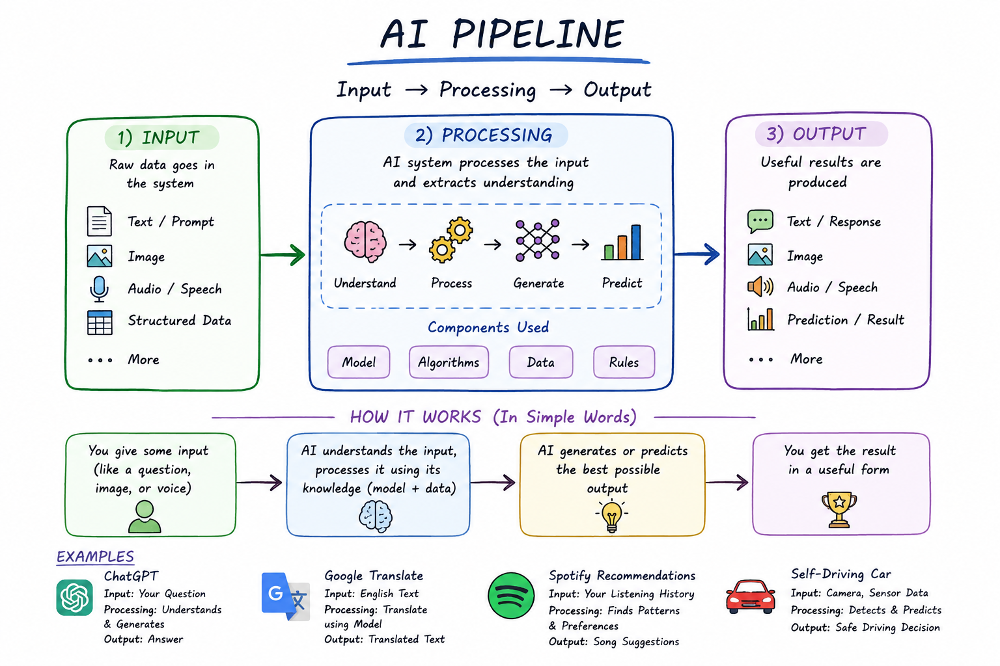

# Day 1: What Does an AI System Actually Do?

## Goal

Build a clear mental model of how AI systems work using the pipeline:
**Input → Processing → Output**

## Key Concept

Every AI product — no matter how complex — follows the same basic shape:
something goes in, the system processes it, something comes out.

## Pipeline Mapping

| Product          | Input                          | Processing                            | Output                           |
| ---------------- | ------------------------------ | ------------------------------------- | -------------------------------- |
| ChatGPT          | Text message from user         | Model generates a reply word by word  | Text reply shown to user         |
| Google Maps      | Current location + destination | Calculates possible routes & traffic  | Best route displayed             |
| Google Translate | Sentence in source language    | Model converts meaning to target lang | Translated sentence              |
| Netflix          | Watch history, ratings, pauses | Predicts what user is likely to enjoy | Personalized recommendation list |

## How a Chatbot Works

When you send a message to a chatbot, the input is the raw text you typed.
The app also resends the whole previous conversation along with your new
message — this is called the **context window**. The model then generates
a reply one word at a time, choosing each word based on everything said so
far. Because the model predicts statistically likely words rather than
verifying facts, it can sometimes produce a wrong answer — this is called
**hallucination**. Finally, the generated words are combined and shown to
the user as the chatbot's response.

## Key Takeaways

- AI pipeline = Input → Processing → Output
- Chatbots don't have built-in memory — they use a context window
- Responses are generated token by token
- Hallucination happens because models predict likely words, not verified truth

## Status

Day 1 of #60DaysAIChallenge — Complete
