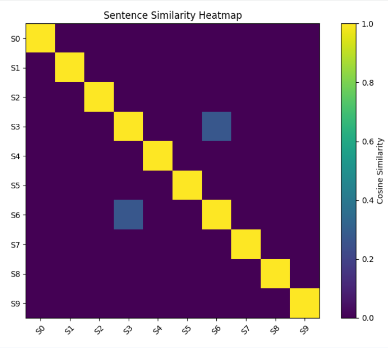

# Day 9: Teaching AI Semantic Meaning Through Vectors

##  Goal
Build a semantic similarity workflow using TF-IDF vectorization and
cosine similarity, compute a full pairwise similarity matrix, visualize
it as a heatmap, and compare TF-IDF's literal matching against the
semantic embeddings used earlier in the challenge.

##  Why Text Needs Numerical Representation
Humans understand that "dog" and "puppy" are related because we
understand meaning. Computers only work with numbers — text is just a
sequence of characters to a machine. AI systems must convert text into
numerical vectors before any mathematical comparison (like similarity)
is possible: Text → Numerical Representation → Mathematical Processing → Similarity.

## Corpus (10 sentences, 3 topics)
Animals (3), Technology (4), Weather (3) — see notebook for full list.

## What I Built

```python
from sklearn.feature_extraction.text import TfidfVectorizer
from sklearn.metrics.pairwise import cosine_similarity
import numpy as np
import matplotlib.pyplot as plt

vectorizer = TfidfVectorizer(stop_words='english')
tfidf_matrix = vectorizer.fit_transform(sentences)  # shape: (10, 53)

similarity_matrix = cosine_similarity(tfidf_matrix)  # shape: (10, 10)

def find_similar(query, corpus, top_k=3):
    query_vector = vectorizer.transform([query])
    scores = cosine_similarity(query_vector, tfidf_matrix)
    top_indices = np.argsort(scores[0])[::-1][:top_k]
    for index in top_indices:
        print(f"Score: {scores[0][index]:.4f}")
        print(f"Sentence: {corpus[index]}")
```

## Test Results

| Query | Top Match | Score |
|---|---|---|
| "dog" | (no match — word not in vocabulary) | 0.0000 |
| "dogs" | "Dogs are loyal and friendly pets." | 0.5000 |
| "puppy" | (no match — word not in vocabulary) | 0.0000 |
| "puppies" | "Puppies need care, food, and attention..." | 0.4082 |
| "airplane" | (correctly unrelated) | 0.0000 |

**Key finding:** TF-IDF only matches exact vocabulary words — "dog" and
"dogs" are treated as completely different tokens, unlike the semantic
embeddings used in Day 4/5 which understood related meaning across
different word forms.

##  Heatmap


10×10 similarity matrix visualized — diagonal is uniformly 1.0 (every
sentence matches itself perfectly). Notably, S3 and S6 (both about
"artificial intelligence") showed clear similarity, but most other
same-topic sentences did NOT cluster strongly, since they didn't share
literal vocabulary.

##  Angle vs Distance
Cosine similarity compares vector direction, not magnitude. Two
sentences of very different lengths can still point in a similar
direction (same topic), even though their vector magnitudes differ
significantly. Using plain distance instead would unfairly penalize
longer sentences just for containing more words, since distance is
sensitive to magnitude in a way that direction is not.

##  Key Takeaways
- TF-IDF represents word importance; embeddings represent deeper meaning
- Cosine similarity's diagonal is always 1.0 (a vector is perfectly similar to itself)
- TF-IDF only recognizes exact vocabulary matches — no understanding of word relationships
- Heatmap clustering with TF-IDF depends on shared literal words, not shared topic/theme

## Status
Day 9 of #60DaysAIChallenge — Complete